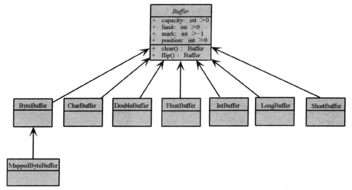
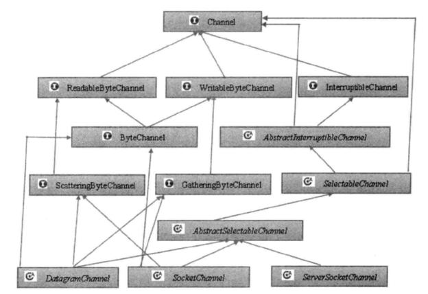
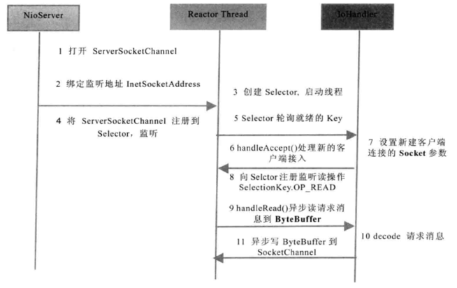
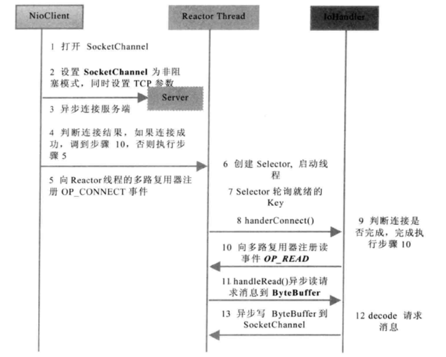
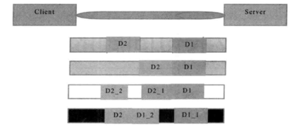
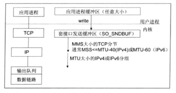

# Netty-learning
系统学习Netty，基于《Netty权威指南-第2版》，归纳每章节的重点。

## 第1章 Java 的IO 演进之路
### 一、五种IO模型
    
    recvfrom 函数可用于从已连接的套接字接口获取数据。

1. 阻塞I/O模型 
    
   process 在读 recvfrom 操作的两个阶段都是等待的；
   1. process 原地等待 kernel 准备数据；
   2. kernel 准备好数据后，process 继续等待 kernel 将数据 copy 到自己的 buffer；
   3. 在 kernel 完成数据的 copy 后 process 才会从 recvfrom 系统调用中返回。

2. 非阻塞I/O模型

   process 在读 recvfrom操作的第一个阶段是不会block等待的。
   1. 如果 kernel 数据还没准备好，那么 recvfrom 会立刻返回一个 EWOULDBLOCK 错误；
   2. 当kernel 准备好数据后，进入处理的第二阶段的时候，process 会等待 kernel 将数据 copy 到自己的 buffer；
   3. 在 kernel 完成数据的 copy 后 process 才会从 recvfrom 系统调用中返回

3. I/O多路复用

   1. select、poll、epoll 模型。在IO多路复用的时候，process 在两个处理阶段都是 block 等待。 优势在于可以以较少的代价来同时监听处理多个IO；
   2. 将一个或多个 df 传递给 select 或 poll 系统调用，阻塞在 select 操作上，select/poll 顺序扫描 df 是否准备就绪；
   3. epoll 基于事件驱动代替顺序扫描。

4. 信号驱动I/O模型

   1. 系统调用 sigaction 执行信号处理函数，立刻返回（非阻塞）
   2. 当数据准备就绪时，就为该进程生成一个 SIGIO 信号；
   3. 通过信号回调通知应用程序调用 revcfrom 来读取数据。
   

5. 异步I/O 

    内核在整个操作后（包括数据从内核复制到用户自己的缓冲区），通知。

### 二、IO多路复用的优势
- 支持一个进程打开的FD不受限制，仅受限于操作系统的最大文件句柄数

    这个数值和系统的内存关系比较大，1GB内存的机器大约是10W个句柄。如何查看：`cat /proc/sys/fs/file-max`。

- IO效率不会随着FD的数目增加而线性增长

    select/poll 调用会线性扫描全部集合，而 epoll 只会针对"活跃"的 socket 操作。
 

- 使用 mmap 加速内核与用户空间的消息传递
    
    select、poll、epoll 都需要内核把 FD 消息通知给用户空间，epoll 通过内核和用户空间使用同一块内存实现。

## 第2章 NIO入门

    网络套接字 = socket

### BIO通信
服务端每收到客户端的连接请求，都会创建一个**新线程**进行链路处理。
 
代码见
`com.szj.learning.basics.bio.*`

### NIO相关概念

- 缓冲区 Buffer
  
    - 原先面向流的IO，读写数据都是直接操作 stream 的，NIO 读写数据都是操作 Buffer 的；
    - 缓冲区实质是一个数组，提供了结构化访问，和维护了读写位置等信息；
    - 网络读写一般使用 ByteBuffer，它提供了更多特有的操作。

- 通道 channel
  
    - stream 是单向的，channel 是双向的；
    - channel 是全双工的；
    - channel 大致分为用于操作网络的 SelectChannel，和用于操作文件的 FileChannel。
    

- 多路复用器 selector
    - 会不断轮询注册在其上的 channel ，如果在 channel 上发生读写事件，那么这个 channel 就处于就绪状态，会被 selector 轮询出来；
    - JDK 使用 epoll 实现多路复用。

### NIO服务端序列

### NIO客户端序列

### NIO通信

代码见 com.szj.learning.basics.nio.*

### AIO通信(NIO2.0)

    真正的异步非阻塞型IO，和NIO的区别在于不需要 selector 轮询结果，而是自动通知回调函数。

代码见 com.szj.learning.basics.aio.*

重点代码解析：

    CompletionHandler<V,A> 这个是 AIO 库中用于异步回调的接口，定义了两个方法：completed() 和 failed()，分别用于操作成功和操作失败时的回调。
    这里的两个泛型参数的意义如下：
    V - 代表 I/O 操作结果的类型。例如，在读或写操作中，V 通常是 Integer，代表成功读取或写入的字节数。
    A - 代表附加的类型，这是一个用于传递给 CompletionHandler 的可选对象。你可以使用它来传递任何你认为在回调中可能需要的信息。在上述示例中，我们使用了 ByteBuffer 作为附加的类型。

    对于 AsynchronousSocketChannel 的 read、write 操作的 CompletionHandler：
    V 是 Integer，表示从操作中读取或写入的字节数。
    A 是 ByteBuffer，表示在操作中使用的缓冲区。

    对于 AsynchronousServerSocketChannel 的 accept 操作的 CompletionHandler：
    V 是 AsynchronousSocketChannel，表示接受的新的 socket 连接。
    A 是 Void，因为我们在这个特定的回调中不需要附加任何特定的信息。

    其实可以看出 CompletionHandler 在某一类特定的场景下，IO 操作对象都是固定的，
    例如 accept 中的 V 为 AsynchronousSocketChannel，read、write 中的 V 为 Integer，
    但是 A 都是人为定义的，是由前面的方法传参过来的，例如 accept 中的 A 传给 CompletionHandler 中的 A...

## 第3章 Netty入门应用

### Netty 简单通信

代码见 com.szj.learning.netty.simple.*

## 第4章 TCP粘包/拆包问题

client 向 server 发送 D1、D2 两个数据包，会发生如下4种情况（第5种D1、D2都被拆成更小的数据包）：

TCP拆包的原因：

    MSS的值是在TCP三次握手期间通过TCP选项字段进行协商的。在连接建立过程中，连接双方都可以指明自己的MSS值，最终，双方将使用较小的那个值作为本次连接的MSS。
    
    每个以太网帧都有一个最大的数据部分大小，称为“最大传输单元”或MTU。对于传统的Ethernet，这个MTU是1500字节。这意味着，如果你想要在以太网上发送一个大于1500字节的数据包，你必须将其分割为多个小的片段，每个都不超过MTU大小。

    IP分片是指当IP层需要发送一个大于当前网络接口MTU的数据包时，它会将该数据包分割成多个更小的数据包。每个分片都会作为独立的IP包发送，但包含了必要的信息以便在接收端重新组装成原始的数据包。

 - 网络拥塞，TCP使用滑动窗口协议进行流控制，可能导致一个完整的应用层数据报文被分割成多个TCP段进行传输；

 - TCP的MSS（最大报文段长度）限制，将应用层数据切分成多个TCP段；

 - 以太网帧的 payload 大于 MTU 进行 IP 分片。

TCP粘包的原因：

 - 应用层发送数据的方式决定，如果应用层连续多次发送小数据包，TCP为了提高网络效率，可能会将这些小数据包合并成一个或几个TCP数据段进行发送；

 - 接收缓冲区策略决定，接收方的TCP栈可能会缓存收到的数据，直到收到了足够多的数据后再通知应用层。
 

代码见 com.szj.learning.netty.lineBased.*

重点代码解析

    LineBasedFrameDecoder 的作用是遍历 ByteBuf 的可读字节，并识别数据的结束位置。(以换行符未结束标志，\n 或者 \r\n)
    如果到了最大长度还是没有发现换行符，就会抛出异常，同时忽略之前读到的异常码流。

## 第5章 分隔符和定长解码器

代码见 com.szj.learning.netty.delimiterBase.*

重点代码解析：

    DelimiterBasedFrameDecoder 指定某个字符作为消息的结束字符，其他逻辑和 上面的 LineBasedFrameDecoder 代码一样类似。
    FixedLengthFrameDecoder 指定长度接收消息。

## 第6章 编解码技术

### JDK编解码

代码见 com.szj.learning.netty.serialization.jdk.*

    JDK编解码占用空间大，时间慢，性能差不推荐使用。

### messagepack编解码

    使用 messagepack 编解码一个自定义的对象类型，需要提前注册这个类型的 template，代码见 MsgpackSerialization。

代码见 com.szj.learning.netty.serialization.messagepack。*

重点代码解析：

    protected void initChannel(SocketChannel ch) throws Exception {
        ch.pipeline().addLast(new LengthFieldBasedFrameDecoder(65535,0,2,0,2))
                .addLast(new MsgpackDecoder())
                .addLast(new LengthFieldPrepender(2))
                .addLast(new MsgpackEncoder())
                .addLast(new MsgpackServerHandler(ch));
    }

    这样的写法默认把消息头设置为2个字节，且仅代表长度的字段。

    LengthFieldBasedFrameDecoder：用来根据长度字段解析数据报，几个参数的含义：
    //  int maxFrameLength 最大的 frame 数据长度
    //  int lengthFieldOffset length 字段的字节数偏移量
    //  int lengthFieldLength length 字段占用的字节数
    //  int lengthAdjustment  需要调整的长度 比如 length(4) head(2) content(n) 此字段为 2
    //  int initialBytesToStrip 往下面传递时，需要跳过的字节数，从起始位置开始而非 length 字段

    LengthFieldPrepender：如果协议中的第一个字段为长度字段，它可以计算当前待发送消息的二进制字节长度，将该长度添加到 ByteBuf 的缓冲区头中。
    
    入站事件（即从网络端读取的数据）是从 pipeline 的头部开始处理，然后依次经过每一个 handler，直到 pipeline 的尾部；而出站事件（即准备写入网络的数据）则是从 pipeline 的尾部开始处理，并依次经过每一个 handler，直到 pipeline 的头部。

困惑很久的一个问题 —— 为什么 pipeline 中的 addLast 一定要那样排列：

    在给定的代码中：
    LengthFieldBasedFrameDecoder 和 MsgpackDecoder 是入站的，它们用于处理从网络中接收的数据。
    LengthFieldPrepender 和 MsgpackEncoder 是出站的，它们用于处理准备写入到网络的数据。
    MsgpackServerHandler 可能包含对入站数据的处理逻辑（例如处理解码后的对象）和对出站数据的处理逻辑（例如写入一个新的消息或响应）。
   
    考虑以下场景：
    
    当一个数据包到达时，它首先通过 LengthFieldBasedFrameDecoder，然后通过 MsgpackDecoder，并最后传递给 MsgpackServerHandler 进行处理。
    在处理数据后，MsgpackServerHandler 可能想要发送一个响应。此时，这个响应首先通过 MsgpackEncoder 进行编码，然后通过 LengthFieldPrepender 添加一个长度字段，最后写入到网络。
    因此，MsgpackEncoder 需要位于 MsgpackServerHandler 之前，确保在 MsgpackServerHandler 决定写入一个消息时，这个消息会先经过 MsgpackEncoder 进行编码，再经过 LengthFieldPrepender 添加长度字段，最后发送到网络。

### protoBuf编解码

    1.mac安装: brew install protobuf
    
    2.pom.xml
     <!--  protobuf 支持 Java 核心包-->
    <dependency>
        <groupId>com.google.protobuf</groupId>
        <artifactId>protobuf-java</artifactId>
        <version>3.23.2</version>
    </dependency>

    3.user.proto 文件
    src/main/resources/user.proto
    
    4.执行
    protoc --java_out=. user.proto
    
通信代码见：com.szj.learning.netty.serialization.protobuf.*

重点代码解析：

    .childHandler(new ChannelInitializer<SocketChannel>() {
        @Override
        protected void initChannel(SocketChannel ch) throws Exception {
            ch.pipeline().addLast(new ProtobufVarint32FrameDecoder())// Varint32 编码的长度前缀()
                    .addLast(new ProtobufDecoder(UserProto.User.getDefaultInstance()))// 解码
                    .addLast(new ProtobufVarint32LengthFieldPrepender())// 发送的 protobuf 消息前面添加一个长度字段，这个长度字段使用 Varint32 编码
                    .addLast(new ProtobufEncoder())// 编码
                    .addLast(new ProtobufServerHandler(ch));
        }
    });
    
    ProtobufVarint32FrameDecoder: 使用Varint32编码来解析长度，（变长，每8位中，第1位代表后面是否还有代表长度的字节，后7位代表长度）
    例如 10101100 00000010 -> 低7位 0101100:44  高7位 00000010:2 = 44 + 2<<7 = 300
    
    ProtobufVarint32LengthFieldPrepender: 发送的 protobuf 消息前面添加一个长度字段，这个长度字段使用 Varint32 编码